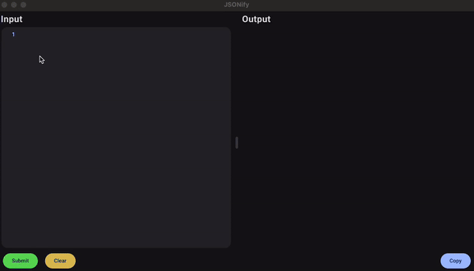

# jsonify

Paste partial or complete JSON data into the input field.  Key names with dot.notation are accepted.  We will then 
parse that into true json and display the output.

## Warning
We try to do some clean up for you in terms of quoting things, correcting single quotes VS double quotes, etc. 
**HOWEVER** we're not perfect.  Not having your commas or colon fields placed correctly will wreak havoc.  
We need those as anchors to figure out what's going on, and what your structure is.  So missing or misplacing 
those characters is fair game.

### For Now and Your Sanity's Sake
You will want to try to strip both `:` and `'` out of your keys and values.  
Otherwise, it'll almost certainly chop them up.

## Hot Keys
- `Cmd + q` - Exit

#### Select Input Area
- `Cmd + Enter` - Submits input
- `Cmd + Backspace` - Clears input

#### Select Output Area
- `Cmd + c` - Copied output

## Building
You need to install the Cogent Core command line tool.  You can then use the `core` command to 
build and run various things.

[Install Instructions](go install cogentcore.org/core/cmd/core@main)
[Build/Run Instructions](https://www.cogentcore.org/core/build#details)

## Release Action
- Requires a version number, eg. 0.0.1
- It will print your input, run the tests, and if they pass, build and push the new release for 
both `darwin/amd64` (Intel Macs) and `darwin/arm64` (Apple/M Series Macs) platforms.  
- Release notes will be the commit titles.

### Developing The Github Action
- Install `act` (local github action runner) - [Act Docs](https://nektosact.com/usage/index.html)
- Execute via `act workflow_dispatch --input tag=0.0.1`
  - Which will install all relevant Action replacement images locally, and run all `workflow_dispatch` 
  workflows in the `.github/workflows` directory.
