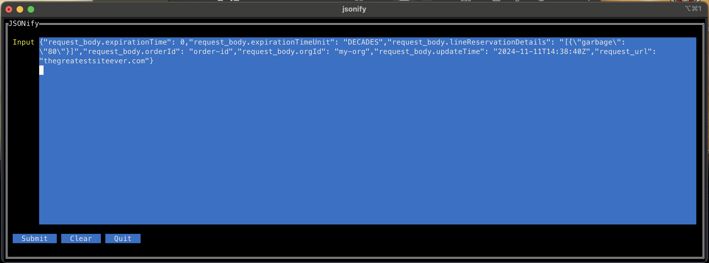
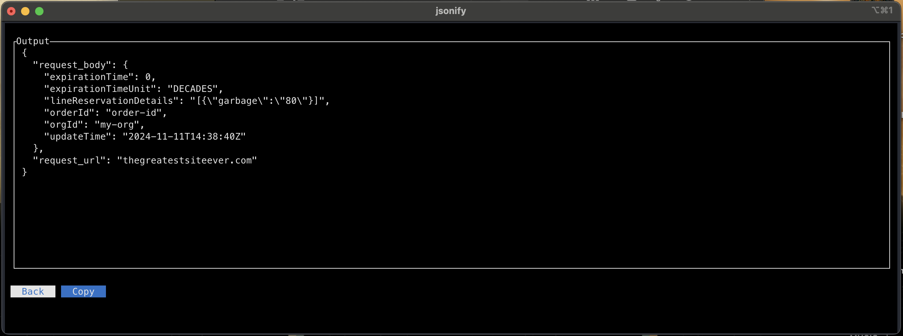
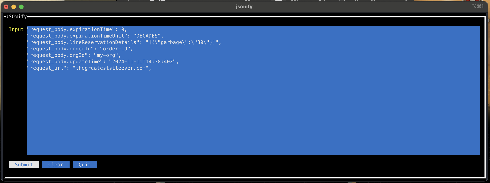
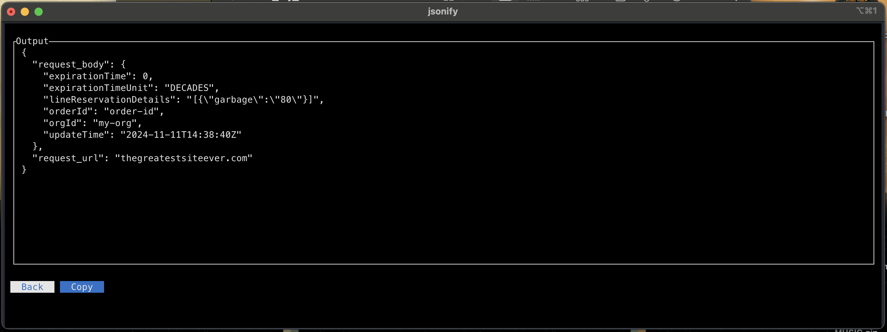

# jsonify

Paste partial or complete JSON data into the input field.  Key names with dot.notation are accepted.  We will then 
parse that into true json and display the output.

## Hot Keys
- `Cntrl + c` - Exit
- `Option + Enter` - Submits input
- `Option + Backspace` - Goes back to input screen
- `Option + d` - Clears input screen

## Examples
#### Valid JSON

#### Invalid JSON w/ Newlines

